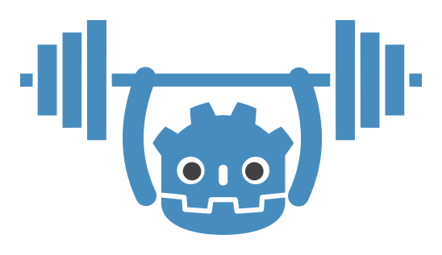

# GodotGymAI



Make your Godot project into OpenAI Gym environment to train RL models with PyTorch. This project only runs on Linux systems.

## Requirements
1. Godot Engine version >= 3.1 compiled from source
2. Boost interprocess
3. Pytorch version >= 1.1
4. Python setuptools

## Installation
First, in **setup.py** change the variable **GODOT_PATH** to the root directory of godot engine source. Then run:
```bash
python setup.py
```
This script does several things:
1. Copies **GodotSharedMemory** module and compiles standard godot editor (x11 platform).
2. Copies **x11_shared** platform, compiles godot with it. This platform is needed to run the evironment.
3. Installs python module **GodotEnv** that is used to communicate with the engine.

## Examples
There are several example environments in the directory **Environments**:

**InvPendulum** shows the example of environment that relies heavily on the physics engine

## Tutorial and API
[Tutorial](https://lupoglaz.github.io/GodotGymAI/tutorial.html)

[API](https://lupoglaz.github.io/GodotGymAI/API.html)

# TODO
1. **Models deployment**: add module to load your traced model into godot engine
2. **Learning from pixels**: passing godot viewport rendering as a torch tensor
3. **Complete tutorial**: tutorial about complete workflow, from empty godot project to training to deployment
